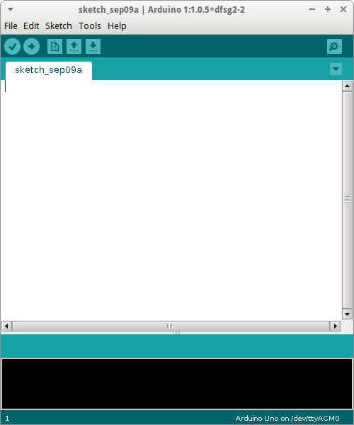
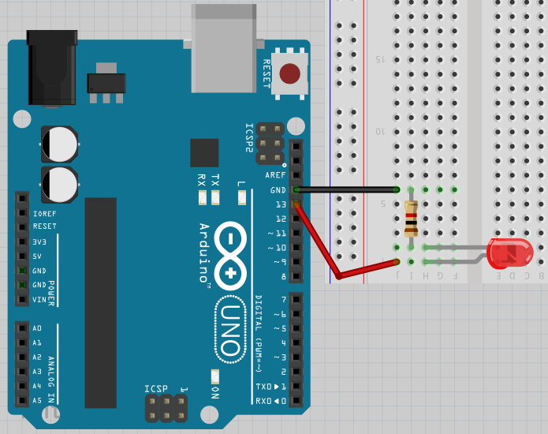

# Les 1a: Blink

In deze les gaan we de allergemakkelijkste schakeling maken die er is: Blink!

In deze les leer je:

 * Hoe je een LEDje aansluit
 * Je eerste Arduino programmeercode
 * Hoe je een LEDje laat knipperen

## Een Arduino aansluiten

Sluit een Arduino zo aan:


Huh? Er hoeft helemaal niks aangesloten te worden? 

Dat klopt! De Arduino heeft namelijk zelf al een lampje.

Je zult wel een USB kabel in de Arduino en in een laptop moeten doen

## De Arduino IDE opstarten

Om een Arduino te programmeren hebben we een programma nodig.
Dit programma noemen we 'de Arduino IDE' (IDE spreek je uit
als 'ie-dee-ee')

De Arduino IDE staat op alle laptops van de cursus.
Hier zie je het logo van de Arduino IDE:


Je kunt de Arduino IDE ook starten, door:

 * Druk op de Windows toets (linksonder, tussen `Ctrl` en `Alt`)
 * Type `arduino` (kleine letters) en dan Enter

Als het goed is, zie je de Arduino IDE:



## Ons eerste programma

Dit is (een versie van) de code van `Blink`:

```
void setup() 
{
  pinMode(13, OUTPUT);
}

void loop() 
{
  digitalWrite(13, HIGH);
  delay(1000);
  digitalWrite(13, LOW);
  delay(1000);
}
```

Wat de code precies doet, dat leer je later.

Om code te kopieeren gebruik je sneltoetsen:

 * `SHIFT + pijltjes`: selecteren
 * `CTRL + A`: alles selecteren
 * `CTRL + C`: kopieren van selectie
 * `CTRL + X`: knippen van selectie
 * `CTRL + V`: plakken van selectie

 * Kopieer de code naar de Arduino IDE
 * Klip op `Upload`

Als het goed is, gaat er een lampje op de Arduino om de seconde aan en uit.

## Blink

Nu is het tijd Blink aan te sluiten:



 * Haal de USB snoer uit de computer, zodat de Arduino geen spanning meer heeft
 * Sluit Blink aan zoals op de tekening
 * Zet de spanning weer op de Arduino
 * Als het goed is, knippert het rode LEDje nu mee met het LEDje op de Arduino. Zo nee, draai de rode LED om :smile:

## Code

Hier staat weer de code van Blink:

```
void setup() 
{
  pinMode(13, OUTPUT);
}

void loop() 
{
  digitalWrite(13, HIGH);
  delay(1000);
  digitalWrite(13, LOW);
  delay(1000);
}
```

Dit is wat het doet:

 * `void setup() {}`: de `setup` function zorgt ervoor dat alles tussen de accolades (`{` en `}`) een keer gedaan wordt
 * `pinMode(13, OUTPUT)`: zeg dat er stroom uit pin 13 kan komen
 * `void loop() {}`: de `function` function zorgt ervoor dat alles tussen de accolades (`{` en `}`) de rest van de tijd herhaald wordt
 * `digitalWrite(13, HIGH)`: zet spanning op pin 13
 * `delay(1000)`: wacht duizend milliseconden
 * `digitalWrite(13, LOW)`: haal de spanning van pin 13 af

## Vragen en opdrachten

 * Hoe lang is duizend milliseconden ongeveer?
 * Wat gebeurt er als je de `digitalWrite(13, HIGH)` weghaalt?
 * Wat gebeurt er als je de `digitalWrite(13, LOW)` weghaalt?
 * Wat gebeurt er als je de eerste `delay(1000)` weghaalt?
 * Wat gebeurt er als je de tweede `delay(1000)` weghaalt?
 * Laat het LEDje 10x zo snel knipperen. Tip: in welke twee regels wacht de Arduino?
 * Laat het LEDje aan en uit gaan zonder wachttijd. Zie je de LED knipperen? Hoe kan dat?
 * Stel de wachttijd zo in, dat je het LEDje nog net kunt zien knipperen. Welke wachttijd is dat ongeveer?

De LED zit nu verbonden met pin 13. Haal de LED uit pin 13 en verbind deze met pin 12.

 * Zorg dat je code weer werkt. Tip: je zult drie keer een 13 moeten veranderen naar een 12
 * Wat gebeurt er als je het LEDje omdraait?
 * Wat gebeurt er als je de weerstand omdraait?
