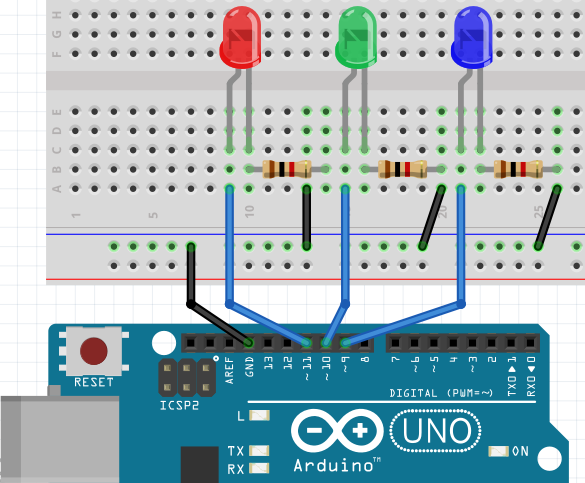
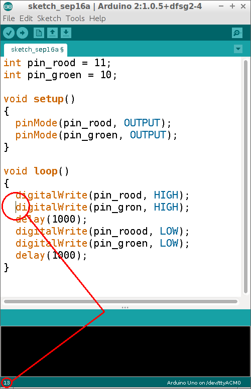

# Les 1b: Blink Blink Blink

Deze les heet 'Blink Blink Blink', omdat het [de les Blink](../1a_Blink/README.md) is, maar dan met drie lampjes.

Weet je nog niet hoe je een lampje aansluit? Ga dan naar [les 1a: Blink](../1a_Blink/README.md).

In deze les leer je:

 * Hoe je meerdere LEDjes aansluit
 * Wat een variable is
 * Hoe je een variabele gebruikt
 * Wat een compile error is
 * Hoe je een programma aanpast 

## Waarom variabelen?

Dit is de code van Blink:

```
void setup() 
{
  pinMode(13, OUTPUT);
}

void loop() 
{
  digitalWrite(13, HIGH);
  delay(1000);
  digitalWrite(13, LOW);
  delay(1000);
}
```

## Vragen en opdrachten

 * Wat doet deze code ook alweer?


 * Sluit Blink aan (het plaatje hierboven). Upload deze code op je Arduino. Wat zie je gebeuren?
 * Als je het getal `13` ziet, waar denk je dan aan? 
 * Als je het getal `1000` ziet, waar denk je dan aan? 
 * Als je het LEDje op een andere pin wil zetten, op hoeveel plekken moet je de code aanpassen?

## Een variabele

Hier zien we Blink met een variabele:

```
int pin_led = 13;

void setup() 
{
  pinMode(pin_led, OUTPUT);
}

void loop() 
{
  digitalWrite(pin_led, HIGH);
  delay(1000);
  digitalWrite(pin_led, LOW);
  delay(1000);
}
```

In de eerste regel zeg je: 
'Lieve Arduino, onthoud een int (dat is een heel getal). 
Ik noem dat hele getal `pin_led`'.
De waarde van `pin_led` is `13`'.

Vanaf nu, als je schrijft `pin_led`, dan vult de Arduino daar `13` in.

## Vragen en opdrachten

 * Upload deze code op je Arduino. Wat zie je gebeuren?
 * Verander de beginwaarde van `pin_led` naar `12`. Het lampje knippert nu niet meer. Pas de bedrading van de machine aan, zodat deze het weer doet
 * Vervang het getal `1000` door een nieuwe variable, `wacht_tijd`. Dit is een int (een heel getal) met de beginwaarde `1000`. 
 * Waarom gebruiken programmeurs variabelen?


## Blink Blink Blink aansluiten

Nu is het tijd 'Blink Blink Blink' aan te sluiten:



 * Haal de USB snoer uit de computer, zodat de Arduino geen spanning meer heeft
 * Sluit de onderdelen aan zoals op de tekening

## Code

Hier staat een stukje code van 'Blink Blink Blink'. 
Er zitten fouten in!

```
int pin_rood = 11;
int pin_groen = 10;

void setup() 
{
  pinMode(pin_rood, OUTPUT);
  pinMode(pin_groen, OUTPUT);
}

void loop() 
{
  digitalWrite(pin_rood, HIGH);
  digitalWrite(pin_gron, HIGH);
  delay(1000);
  digitalWrite(pin_roood, LOW);
  digitalWrite(pin_groen, LOW);
  delay(1000);
}
```

## Vragen en opdrachten

 * Upload deze code naar de Arduino. Welke fouten krijg je?

## Compile error

In de code zijn een aantal variabele namen verkeerd geschreven. Dat kun je
ook zien in de rode letters:


Deze fout wordt een compile error ('kompaail error') genoemd. 
'compile' is Engels voor 'samenbinden'.
'error' is Engels voor 'fout'.
De compiler ('kompaailer') is een programma dat programmeercode omzet naar machinetaal.
De compiler leest erg precies.
De compiler heeft ook altijd gelijk.

Terug naar onze compile error:


De compiler laat zien in welke regels de fout(en) zitten.
In dit geval in regels 13 en 15.
Je hoeft niet te tellen welke regels zit zijn:
de Arduino IDE laat dit altijd zien:



Nu weten we *waar* de fout is, nu weten we nog niet *wat* de fout is.

```
'pin_gron' was not declared in this scope
```

Dit kan je vertalen naar:

```
Lieve programmeur, ik weet niet wat 'pin_gron' is
```

De compiler heeft gelijk: bovenaan de code hebben we het pinnummer
van de groen led ook anders genoemd!

## Vragen en opdrachten

 * Repareer de code
 * Laat de lampjes omstebeurt om de seconde knipperen, zonder dat beide lampjes uit staan
 * Laat de lampjes omstebeurt om de seconde knipperen, met steeds een second ertussen dat de lampjes uit staan
 * Maak een derde variabele, een heel getal met de naam `pin_blauw`. Laat nu de drie LEDjes knipperen.


