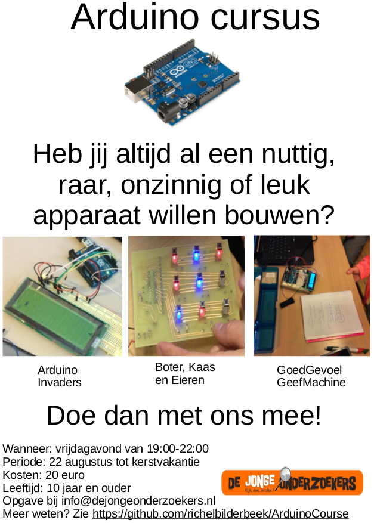

# Arduino cursus bij De Jonge Onderzoekers

Dit is de GitHub van de Nederlandse Arduino cursus gegeven bij De Jonge Onderzoekers te Groningen.

### Over de cursus

Groep|Nano's|Uno's|Mega's
Leeftijd|8-12|12-18|18+
Inloop|18:00|19:00|20:00
Start les|18:15|19:15|20:15
Pauze les|19:00|20:00|21:00
Vervolg les|19:15|20:15|21:15
Einde les|20:00|21:00|22:00

 * Wanneer: elke vrijdagavond, behalve in de kerstvakantie. Eerste les in 2016 is op 8 januari
 * Hoe laat: zie bovenstaand lesrooster
 * Waar: De Jonge Onderzoekers Groningen (www.djog.nl)
 * Periode: 22 augustus tot kerstvakantie
 * Kosten: 20 euro eenmalig
 * Leeftijd: 8-28 jaar
 * Meenemen: Arduino (als je die hebt), laptop (als je die hebt), electronica (als je dat hebt)
 * Wanneer instromen: altijd!

Leermateriaal: we gebruiken het boek [Interactief Ontwerpen Met Arduino](https://sites.google.com/site/hwcontwerpen/interactief-ontwerpen-met-arduino) ([PDF](Boeken/interactief ontwerpen met arduino.pdf)) (we hebben een aantal boekjes gedrukt om te gebruiken) en ons eigen materiaal op deze GitHub.

### Vragen

## Ik ben jonger dan acht jaar oud, ben ik welkom?

Ja. We zien wel dat leerlingen veel jonger dan 8 jaar oud electronica en programmeren erg moeilijk vinden. Maar je mag het altijd komen proberen.

## Ik ben ouder dan 28 jaar oud, ben ik welkom?

Ja. Nieuwe volwassenen zullen door de jongeren opgeleid worden (van 18:15-20:00). Dit is het meest leerzaam voor de *jongeren*. Voel je dus vooral welkom. Volwassenen zal daarna vriendelijk gevraagd worden om minstens een van de volgende dingen te gaan doen:
  (1) gave dingen te bouwen om de leerlingen te inspireren 
  (2) assisteren bij de lessen door de leerlingen met hun vragen te helpen
  (3) lessen te geven

Hierbij geldt de regel is dat de kinderen altijd voor gaan. Na 21:00 gaan de kinderen weg, dus er is ook tijd voor onderwijs speciaal voor de volwassenen.

## Ik heb geen [...]. Is dat erg?

Nee, wij hebben wel reserve laptops, Arduino's, electronica, etc.

We zien wel dat het handiger voor de leerlingen is een eigen laptop te hebben. Ook merken we dat leerlingen na zes lessen hun ouders gaan vragen om een Arduino om thuis mee te werken. Wij verkopen een startersetje voor 35 euro voor inkoopsprijs.

## Mag ik games maken?

Jazeker! Sterker nog, het programmeren van games is een van de leukste manieren om electronica en programmeren te leren.

## Mag ik gamen?

Nee. Gamen vinden we nooit goed: niet tijdens de les, niet voor de les, niet in de pauze, niet na de pauze.
De vrijdagavond is een cursus avond, waarbij leren voorop staat. Gamen draagt niet bij aan het leren programmeren. Heb je *zelf* een spel geprogrammeerd, dan krijg je de ruimte om het spel te laten zien en te laten testen. 

## Hoe kan het dat de cursus zo goedkoop is?

Omdat we enkel met vrijwilligers werken.

## Kan zo een goedkope cursus wel goed zijn?

Volgens de leerlingen wel. In de twee enquetes per jaar scoort de cursus gemiddeld een 9 op 10. Misschien omdat de vrijwilligers constant bezig zijn met de cursus te verbeteren...

## Wat is de missie van de cursus?

De missie van De Jonge Onderzoekers is: '[Het] exploiteren van een activiteitencentrum met als doel kinderen op een uitdagende en creatieve manier met techniek en wetenschap in aanraking te laten komen'. De missie van de Arduino cursus heeft veel overlap hiermee. We vinden het belangrijk dat de kinderen iets leren, uitgedaagd worden en hun creativiteit gebruiken om iets te maken. Leerlingen krijgen kort uitleg, werken in het begin een boek door, maar worden ook gestimuleerd elkaar te helpen, zelf les te geven en mee te beslissen.
